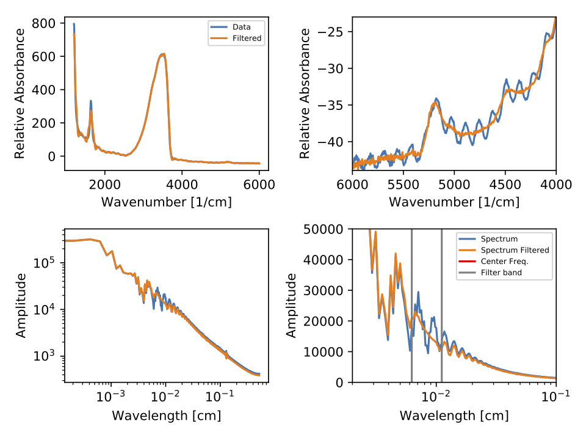

# FTIRDamper
Filters FTIR Data

### Usage 

```shell
python ./ftir_damper.py
usage: ftir_damper.py [-h] [-p] [-w W] [-c C] [-o O] csvfile outfile

Remove wiggles in FTIR data

positional arguments:
  csvfile     csv file with wavenumber, intensity
  outfile     csv output file

optional arguments:
  -h, --help  show this help message and exit
  -p          generate plot file
  -w W        Bandstop filter Half width in wavenumber [ 35 ]
  -c C        Bandstop filter central value in wavenumber [ 125 ]
  -o O        Order of the filter [2]
```

### Example
```shell
python ./ftir_damper.py -p -w 35  -c 125 -o 2 wiggle.csv wiggleout.csv
```
This takes in wiggle.csv with `Wavenumber,intensity` as the format and
outputs the filtered data, wiggleout.csv along with a plot of the 
data as a PDF.



### License
BSD 2-Clause
